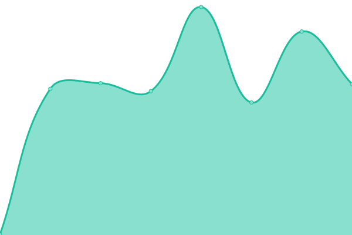

# [📈 Live Status](https://status.formslogic.com): <!--live status--> **🟥 Complete outage**

This repository contains the open-source uptime monitor and status page for [Forms Logic, Inc](https://www.formslogic.com), powered by [Upptime](https://github.com/upptime/upptime).

With [Upptime](https://upptime.js.org), you can get your own unlimited and free uptime monitor and status page, powered entirely by a GitHub repository. We use [Issues](https://github.com/formslogic/status/issues) as incident reports, [Actions](https://github.com/formslogic/status/actions) as uptime monitors, and [Pages](https://status.formslogic.com) for the status page.

<!--start: status pages-->
<!-- This summary is generated by Upptime (https://github.com/upptime/upptime) -->
<!-- Do not edit this manually, your changes will be overwritten -->
<!-- prettier-ignore -->
| URL | Status | History | Response Time | Uptime |
| --- | ------ | ------- | ------------- | ------ |
|  [Formslogic.com](https://www.formslogic.com) | 🟥 Down | [formslogic-com.yml](https://github.com/formslogic/status/commits/HEAD/history/formslogic-com.yml) | 

 615ms
     
 | 

<a href="https://status.formslogic.com/history/formslogic-com">100.00%</a>
    

|  Production | 🟥 Down | [production.yml](https://github.com/formslogic/status/commits/HEAD/history/production.yml) | 

 261ms
     
 | 

<a href="https://status.formslogic.com/history/production">99.89%</a>
    

|  Staging | 🟥 Down | [staging.yml](https://github.com/formslogic/status/commits/HEAD/history/staging.yml) | 

 305ms
     
 | 

<a href="https://status.formslogic.com/history/staging">100.00%</a>
    

<!--end: status pages-->

[**Visit our status website →**](https://status.formslogic.com)

## 📄 License

- Powered by: [Upptime](https://github.com/upptime/upptime)
- Code: [MIT](./LICENSE) © [Anand Chowdhary](https://anandchowdhary.com), supported by [Pabio](https://pabio.com)
- Data in the `./history` directory: [Open Database License](https://opendatacommons.org/licenses/odbl/1-0/)
